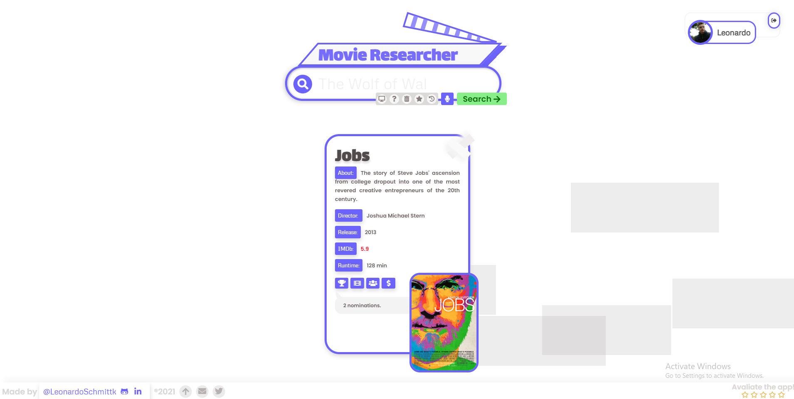

# Movie Researcher :cinema:

-  Type in whichever film/series and the main info about it will print out through cards. Also, you can add label your favorite ones;
-  Movies API used: *https://omdbapi.com*

## Challenges:

-  Animations and SVG;
-  Responsitivity;
-  API and promises;
-  Firebase Firestore;
-  Firebase Hoisting;
-  Git Kraken;
-  Sass in the npm form
-  As much functional as possible;

## Stack:

-  Vanilla JavaScript;
-  Node-Sass;
-  BEM Syntax;
-  HTML5;
-  CSS3;
-  Icons by Font-Awesome;
-  Fonts by Google Fonts;
-  GIT;

---

_made with :purple_heart:_
